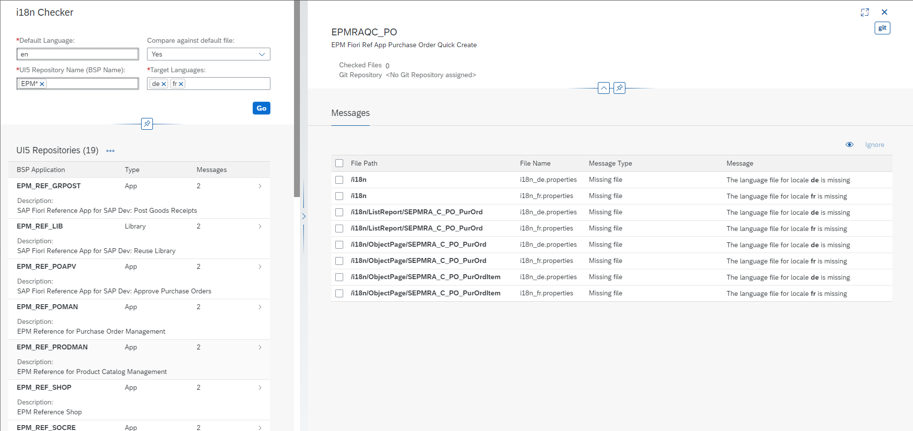

# i18n-checker
Perform checks for i18n-files in UI5 repositories (i.e. BSP applications)

## Overview
The app is a freestyle SAPUI5 application which utilizes the Flexible Column Layout.  
It allows the user to check UI5 repositories (apps and libraries) that are deployed to an ABAP system for missing or incomplete texts in `i18n` files.  
The data retrieval is done via a simple REST web service which can be installed via the abapGit repository [abap-i18n-checker](https://github.com/stockbal/abap-i18n-checker). 



## Runtime requirements
- Modern browser - Internet Explorer is not supported
- Minimum SAPUI5 framework version is 1.71.28

## Dependencies
- [abap-i18n-checker](https://github.com/stockbal/abap-i18n-checker) needs to be installed in the backend ABAP system. 

## Setup
1) Install all node dependencies
```
$ npm i
```
2) Create `.env`-file for testing/deployment
```env
# variables for Proxy
PROXY_AUTH_USER=<username on ABAP system>
PROXY_AUTH_PASS=<password on ABAP system>
PROXY_TARGET=<URL to ABAP system>

# variables for ABAP Deployment
UI5_TASK_NWABAP_DEPLOYER__USER=<username on ABAP system>
UI5_TASK_NWABAP_DEPLOYER__PASSWORD=<password on ABAP system>
UI5_TASK_NWABAP_DEPLOYER__SERVER=<password on ABAP system>
UI5_TASK_NWABAP_DEPLOYER__CLIENT=<URL to ABAP system>
UI5_TASK_NWABAP_DEPLOYER__TKORRNO=<optional transport request>

# UI5 Library paths
SAPUI5_RESOURCES=<root path to unpacked saoui5 lib>/resources
SAPUI5_TEST_RESOURCES=<root path to unpacked saoui5 lib>/test-resources
```

## Testing
```
$ npm run start
```

## Deployment to ABAP System

### Initial deployment
First install the abapGit repository [abap-i18n-checker](https://github.com/stockbal/abap-i18n-checker) as it also includes this app. This automatically creates the UI5 repository in the correct package. 

### Further deployments

```
$ npm run deploy
```
